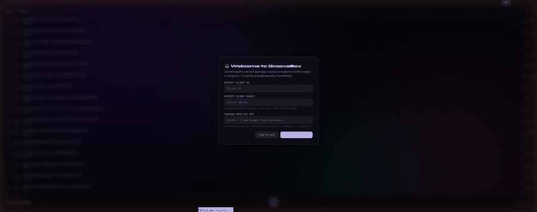
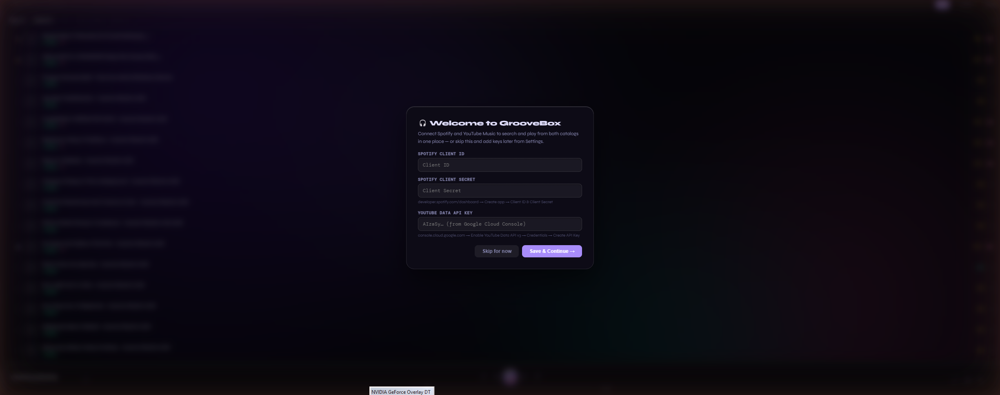
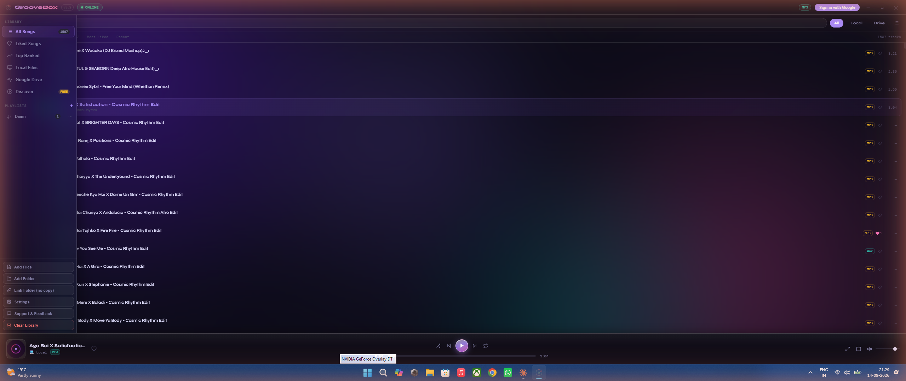
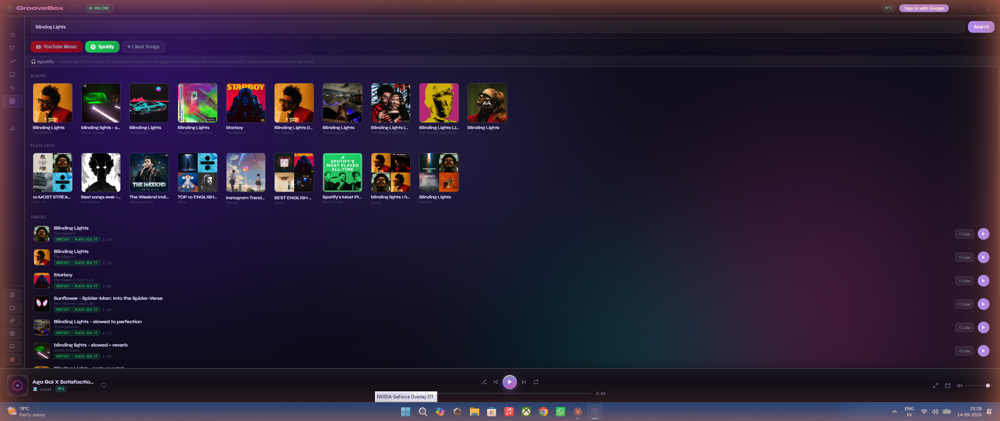
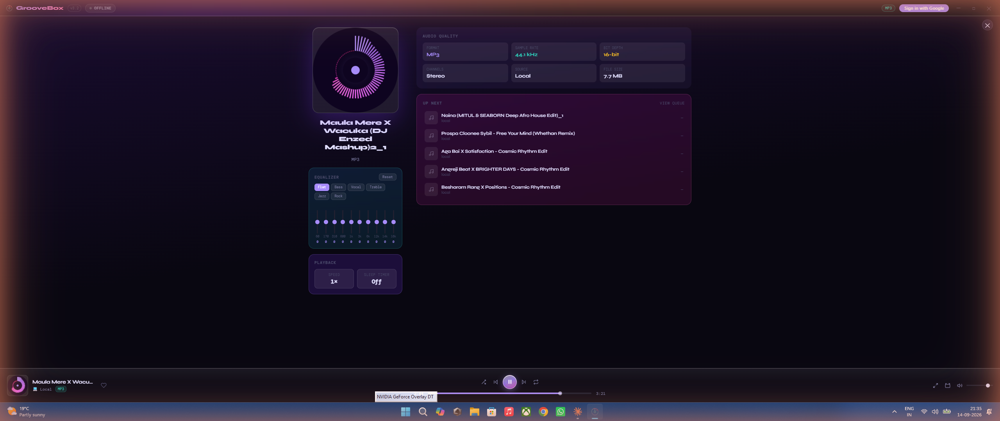
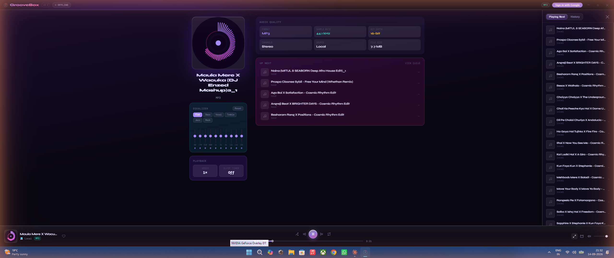
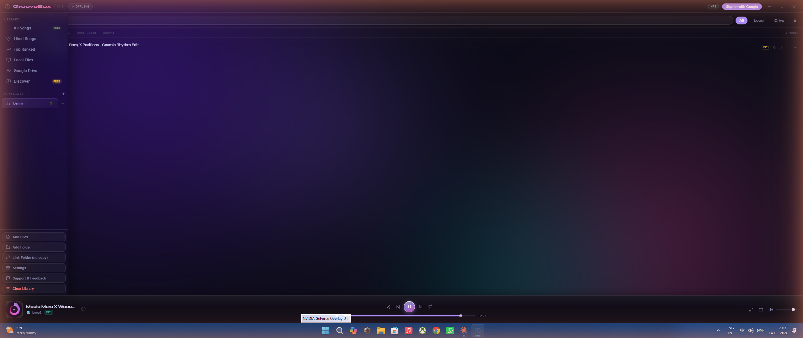
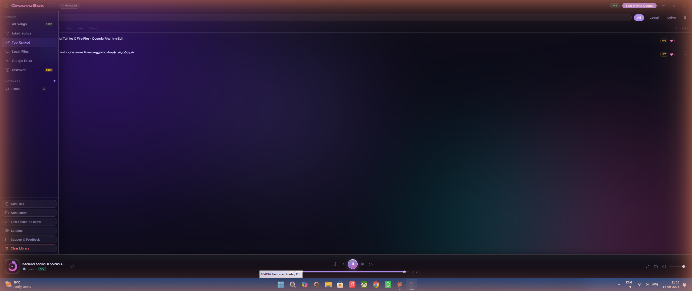
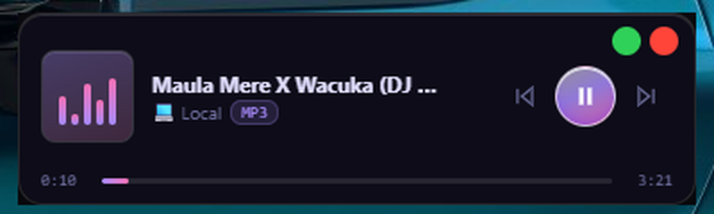

<div align="center">
  
  <h1>GrooveBox</h1>
  <p><strong>Your music. No subscription needed.</strong></p>
  <p>
    
    
    
  </p>
</div>

---

GrooveBox is a free, open-source desktop music player that plays your local files, Google Drive music, and lets you search **Spotify and YouTube Music from the same window** — with a translucent glass UI, visualizer, playlists, equalizer, likes & ranking, and more.



## Features

| Feature | Details |
|---------|---------|
| 🎧 **Spotify + YouTube Music, one search box** | Search Spotify's catalog for accurate metadata, and YouTube Music for full-length streaming — both sources side by side, no switching apps |
| 🌫 **Glass UI** | Translucent, blurred panels throughout — mini player, full player, settings |
| 🎛 **10-Band EQ** | Real-time equalizer with reset |
| ♥ **Likes & Ranking** | Cumulative likes, medal-ranked Top Ranked view |
| 🪟 **Mini Player** | Always-on-top compact player with visualizer |
| 📋 **Playlists** | Unlimited, right-click to add, custom cover art with automatic fallback for tracks that don't have their own |
| 📜 **Queue & History** | Playing Next queue plus play history, in a side panel |
| ☁ **Google Drive** | Paste folder link, stream instantly — no sign-in required |
| 💾 **Persistent Library** | Add once, always there |
| 🌊 **Live Visualizer** | Real-time frequency display |
| ⏱ **Sleep timer & playback speed** | Auto-stop on a timer, 0.5×–2× speed control |
| ⚡ **Keyboard Shortcuts** | Space, arrows, S, R, L, F, M and more |

## Screenshots

| | |
|---|---|
|  |  |
|  |  |
|  |  |
|  |  |

## Getting your own API keys

GrooveBox never ships with bundled API keys — you bring your own, free ones, entered locally on your machine (never sent anywhere but Spotify/Google's own APIs). On first launch, a setup screen offers to walk you through this, with a **Skip for now** option if you just want local-file playback.

| Service | Where to get a free key | Needed for |
|---------|--------------------------|------------|
| Spotify | [developer.spotify.com/dashboard](https://developer.spotify.com/dashboard) → Create app → Client ID & Secret | Spotify search/metadata |
| YouTube Data API v3 | [console.cloud.google.com](https://console.cloud.google.com) → Enable API → Credentials → API key | YouTube Music search & playback |
| Google Drive (optional) | Same Cloud Console project → OAuth Client ID & Secret | Drive folder sync |

Full walkthrough in [INSTALL.md](INSTALL.md).

## Download

👉 **[Download latest release](https://github.com/akshit1503/groovebox-desktop/releases/latest)**

| Platform | File |
|----------|------|
| Windows 10/11 | `GrooveBox-Setup-*.exe` |
| macOS 12+ | `GrooveBox-*.dmg` |
| Linux | `GrooveBox-*.AppImage` |

## Development

```bash
# Clone the repo
git clone https://github.com/akshit1503/groovebox-desktop.git
cd groovebox

# Install dependencies
npm install

# Run in development
npm start

# Build for your platform
npm run build:win     # Windows .exe
npm run build:mac     # macOS .dmg
npm run build:linux   # Linux AppImage
```

## Releases

Releases are automated via GitHub Actions. To publish a new release:

```bash
git tag v3.1.0
git push origin v3.1.0
```

GitHub Actions will automatically build for all three platforms and create a release.

## License

MIT © 2025 Akshit Singh · [akshitsingh153@gmail.com](mailto:akshitsingh153@gmail.com)
